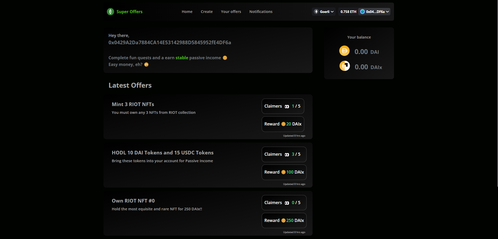

# Super Offers

Complete on-chain tasks and get a constant stream of income

### Description

Repudiation (Denial of an act) is one of the major issues in creating offers or agreements with anyone online. It requires trust that a person would provide the money/service on completing the deal. SuperOffers solves this problem. The entire logic is handled on-chain without any DAO or third-party involved which makes it completely trust-free and transparent.

The workflow involves two different types of users:

1. Offerer
2. Claimer

The Offerer creates a super offer declaring the total bounty reward etc. Here comes the interesting part. Offer is not created by any off-chain logic. The offerer enters the contract address, contract abi and chooses a function signature and an expected value on calling the function. Multiple functions from multiple contracts can be added for the same offer. When any claimer satisfies this logic, he can apply for a claim and the smart contract starts streaming him tokens until the Offer timeline ends. This way the entire task completion and money streaming is done completely on-chain with no chance of denying an act or betrayal.

I am looking forward for the Streaming Distributions (Coming soon) feature in SuperFluid which would be the perfectly suited for this usecase. It would also save up some of my complex smart contract logic 😅.

Possible use cases for Super Offers can be:

1. Hold 2 Bored Ape NFTs
2. Hold 25 LINK Tokens.
3. Make 10 proposals in CompoundDAO
4. Hold Token #1200 in CyperPunks NFT collection.
   The possibilities are endless..

### Challenges

I struggled with developing the logic for my solidity smart contracts. I ran into a lot of issues when making low level calls to smart contracts and then when debugging and verifying the execution of the logic.
I have developed dApps with theGraph but this time I ran into a lot of issues in depolying my subgraph.
All other challenges were manageable :)

